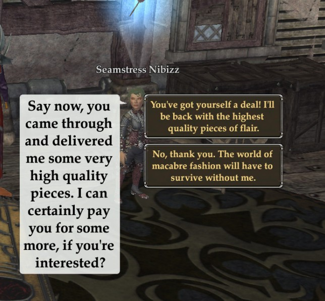
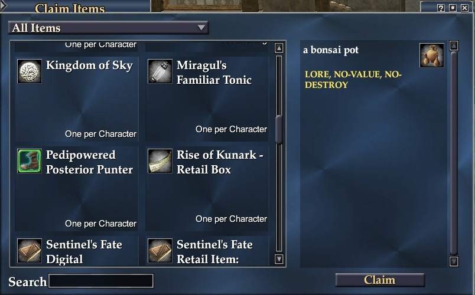
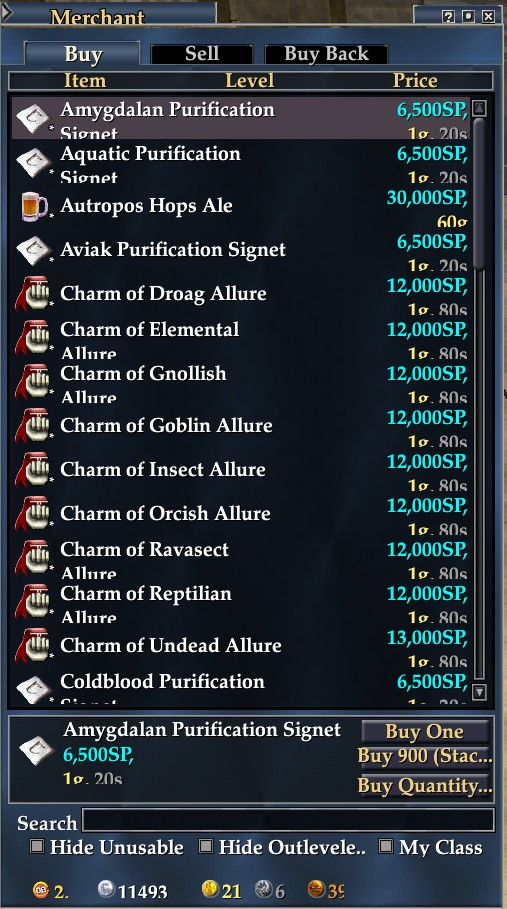
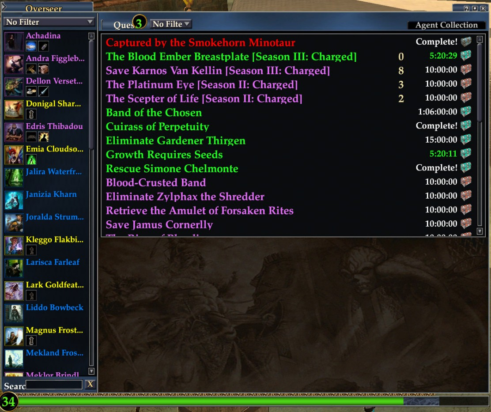
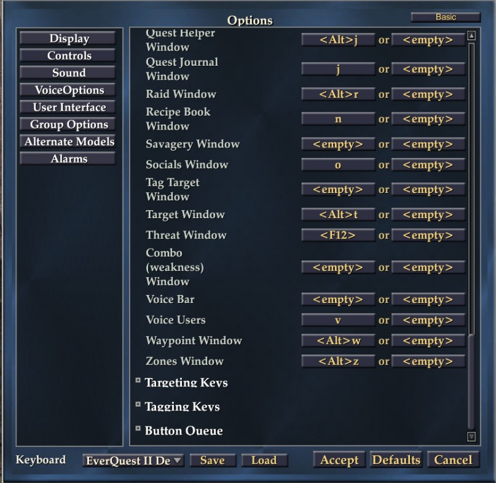

# Profit UI CE 4k edition
This repo contains ProfitUI CE with 4k fixes. It already have eq2map integrated.
It's work in progress so not all windows looks good.
Some preview is located in `Preview` folder of repo

# Installation

1. Checkout repository into `Everquest2/UI` folder as `ProfitUI_CE`. If you already have `ProfitUI_CE` - use another folder name
```
git clone https://github.com/Kvalme/profitui_ce_4k.git ProfitUI_CE
```

3. Set ProfitUI_CE as default UI in eq2.ini. It should contain following lines:
```
cl_ui_skinname ProfitUI_CE
cl_ui_subdir UI/
```

# Configuration

I've added Templates/ProfitUI_4k_eq2_uisettings.xml as the possible window layout. It increases hotkey icon size and box sizes.
It can be copyed to Everquest2 folder and then loaded using `/load_uisettings` command

# Update

In order to update you can just go to folder where you checked out repository and do `git pull` and you will have updated version

# Preview






